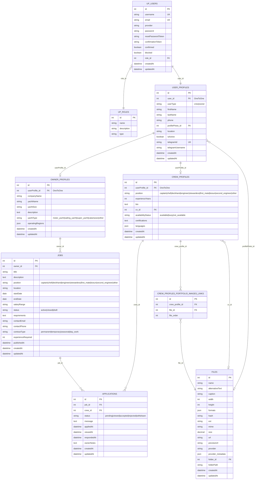

# Express.js Backend for Crew Telegram Jobs

This is the Express.js backend application for the Crew Telegram Jobs platform. It provides a RESTful API for managing users, profiles (crew and owner), job listings, applications, and file uploads, with integrated Telegram authentication.

## Table of Contents

- [Features](#features)
- [Database Schema](#database-schema)
- [Getting Started](#getting-started)
  - [Prerequisites](#prerequisites)
  - [Environment Variables](#environment-variables)
  - [Running with Docker Compose](#running-with-docker-compose)
- [API Endpoints](#api-endpoints)
- [Testing](#testing)
  - [Verifying MongoDB Connection](#verifying-mongodb-connection)
  - [Testing CRUD Operations via Swagger UI](#testing-crud-operations-via-swagger-ui)
  - [Testing CRUD Operations via cURL](#testing-crud-operations-via-curl)
  - [Testing Telegram Authentication](#testing-telegram-authentication)

## Features

- **User Management:** Basic CRUD operations for user accounts.
- **Profile Management:** Dedicated profiles for crew members and job owners.
- **Job Listings:** Create, read, update, and delete job postings.
- **Applications:** Manage job applications from crew members.
- **File Management:** Handle file uploads (e.g., CVs, portfolio images).
- **Role-Based Access:** Basic role management for users.
- **Telegram Authentication:** Secure user login via Telegram Login Widget with hash verification.
- **API Documentation:** Interactive API documentation using Swagger UI.

## Database Schema

The application's data model is based on the following ER Diagram:



## Getting Started

To get the Express.js backend up and running, it's recommended to use Docker Compose, which will also spin up a MongoDB instance.

### Prerequisites

- [Docker](https://www.docker.com/get-started)
- [Docker Compose](https://docs.docker.com/compose/install/)

### Environment Variables

Create a `.env` file in the `express-backend` directory with the following content:

```dotenv
TELEGRAM_BOT_TOKEN=YOUR_TELEGRAM_BOT_TOKEN
```

**Replace `YOUR_TELEGRAM_BOT_TOKEN` with the actual token obtained from BotFather on Telegram.** This token is crucial for verifying Telegram login data.

### Running with Docker Compose

Navigate to the root directory of your project (`crew-telegram-jobs`) and run the following command:

```bash
docker compose up --build -d express-backend
```

This command will build the Docker image for your Express.js backend and start it along with a MongoDB container. The `-d` flag runs the containers in detached mode.

## API Endpoints

The API documentation is available via Swagger UI once the server is running. Open your web browser and go to:

`http://localhost:5000/api-docs`

Here you can explore all available endpoints, their request/response schemas, and even test them directly.

## Testing

### Verifying MongoDB Connection

To confirm that the Express.js backend has successfully connected to MongoDB, check the Docker logs for the `express-backend` service:

```bash
docker compose logs express-backend | grep "MongoDB connected"
```

You should see `MongoDB connected` in the output.

### Testing CRUD Operations via Swagger UI

1.  Open `http://localhost:5000/api-docs` in your browser.
2.  Expand any of the API sections (e.g., `Users`, `Jobs`).
3.  Click on an endpoint (e.g., `POST /api/users`).
4.  Click "Try it out".
5.  Modify the example request body if needed.
6.  Click "Execute" to send the request and view the response.

### Testing CRUD Operations via cURL

You can also test the API directly using `cURL` from your terminal. Here are some examples:

**1. Create a Role:**
```bash
curl -X POST -H "Content-Type: application/json" -d '{
  "name": "Crew",
  "description": "Crew member role",
  "type": "authenticated"
}' http://localhost:5000/api/roles
```

**2. Create a User (replace `ROLE_ID` with an actual role ID from the previous step):**
```bash
curl -X POST -H "Content-Type: application/json" -d '{
  "username": "testuser_unique",
  "email": "test_unique@example.com",
  "password": "password123",
  "role": "<ROLE_ID>"
}' http://localhost:5000/api/users
```

**3. Get all Users:**
```bash
curl http://localhost:5000/api/users
```

**4. Create a Job (replace `OWNER_PROFILE_ID` with an actual ID):**
```bash
curl -X POST -H "Content-Type: application/json" -d '{
  "owner": "<OWNER_PROFILE_ID>",
  "title": "Experienced Chef Needed",
  "description": "Looking for a chef for a superyacht.",
  "position": "chef",
  "location": "Palma de Mallorca",
  "startDate": "2025-09-01",
  "endDate": "2025-11-30",
  "salaryRange": "5000-8000 EUR/month",
  "requirements": "Culinary degree, STCW",
  "contactEmail": "jobs@yachting.com",
  "contractType": "seasonal",
  "experienceRequired": 5
}' http://localhost:5000/api/jobs
```

### Testing Telegram Authentication

This involves the `telegram-auth-app` and the `express-backend`.

1.  **Ensure your Telegram Bot is configured:**
    *   Go to `@BotFather` in Telegram.
    *   Use the `/setdomain` command and select your bot.
    *   **Crucially, set the domain to the exact Ngrok HTTPS URL** that your `telegram-auth-app` is being served from (e.g., `https://your-random-subdomain.ngrok.io`). This URL is generated when you run `ngrok http 3001`.

2.  **Start Ngrok (if not already running):**
    In a new terminal, from your project root, run:
    ```bash
    ngrok http 3001
    ```
    Note the `https://` URL provided by Ngrok.

3.  **Access the Telegram Auth App:**
    Open your web browser and go to the **Ngrok HTTPS URL** (e.g., `https://your-random-subdomain.ngrok.io`).

4.  **Initiate Telegram Login:**
    Click the "Login with Telegram" button and follow the authentication steps in the pop-up.

5.  **Verify Backend Logs:**
    After successful authentication, the `telegram-auth-app` will send the user data to your `express-backend` for verification. Check the `express-backend` Docker logs:

    ```bash
    docker compose logs express-backend | grep "Telegram authentication"
    ```

    You should see `Telegram authentication successful` if the hash verification passed, or `Telegram authentication failed: Invalid hash` if there was an issue (e.g., incorrect `TELEGRAM_BOT_TOKEN` or domain mismatch).
